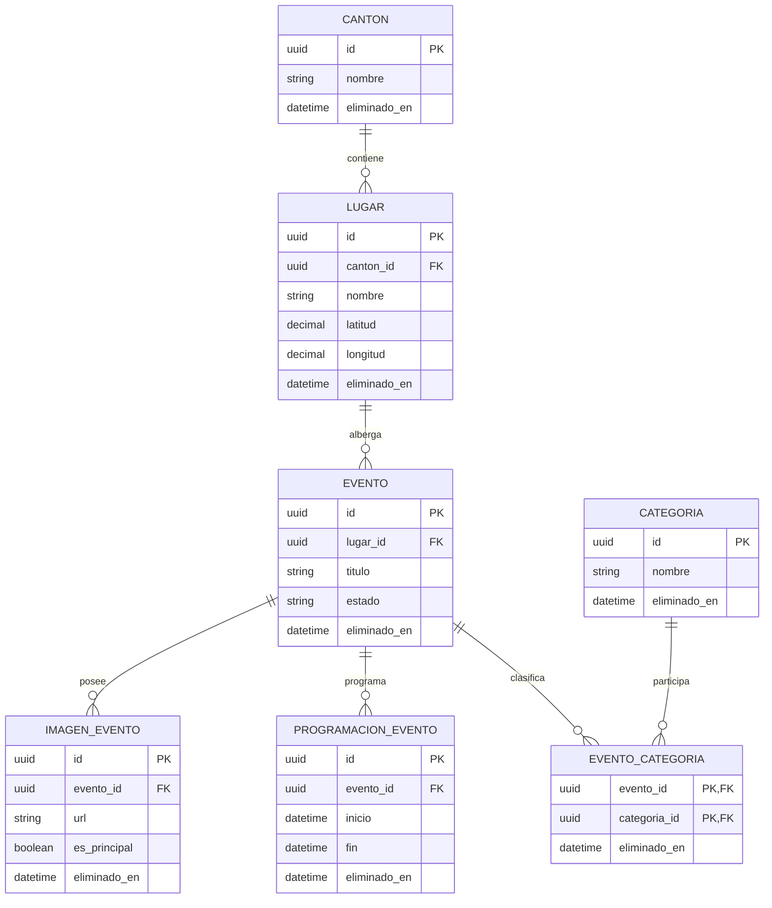

# Modelo relacional y evidencia de verificación (001)

## Identificación

- **Funcionalidad:** 001 — modelo de datos y backend inicial.
- **Rama:** `feat/001-modelo-datos`.
- **Fecha de verificación:** 2026-07-19.
- **Motor:** PostgreSQL 18.1.
- **ORM:** Prisma 7.8.0.
- **Entorno de ejecución:** Node.js 24.14.0.

## Alcance verificado

Esta etapa implementa exclusivamente el modelo relacional del dominio inicial de ZamoraFest, la migración reproducible, los datos iniciales de cantones y las pruebas de sus restricciones.

No incorpora CRUD de eventos, autenticación, Swagger, Redis, BullMQ ni aplicación móvil.

## Diagrama entidad-relación



## Tablas implementadas

| Tabla                   | Responsabilidad                                      |
| ----------------------- | ---------------------------------------------------- |
| `cantones`              | Cantones de Zamora Chinchipe.                        |
| `lugares`               | Lugares pertenecientes a un cantón.                  |
| `categorias`            | Clasificación de eventos.                            |
| `eventos`               | Información principal de los eventos.                |
| `evento_categorias`     | Relación muchos-a-muchos entre eventos y categorías. |
| `programaciones_evento` | Fechas y horarios de un evento.                      |
| `imagenes_evento`       | Imágenes asociadas a un evento.                      |

## Restricciones verificadas

- Las siete entidades utilizan eliminación lógica mediante `eliminado_en`.
- Las claves foráneas aplican borrado físico restrictivo.
- Un evento inicia en estado `BORRADOR`.
- Una asociación entre evento y categoría no puede repetirse.
- Solo puede existir una imagen principal activa por evento.
- Una imagen principal eliminada lógicamente permite registrar otra principal.
- Latitud y longitud deben proporcionarse juntas y dentro de sus rangos.
- El final de una programación debe ser posterior a su inicio.
- Los nombres activos de cantones y categorías son únicos.
- Un nombre puede reutilizarse después de la eliminación lógica correspondiente.

## Preparación local

Los valores reales de conexión se guardan únicamente en `.env` y `.env.test`, archivos excluidos de Git.

Las plantillas versionadas son:

- `backend/.env.example`
- `backend/.env.test.example`

Las bases utilizadas son:

- `zamorafest_dev`: desarrollo.
- `zamorafest_test`: pruebas automatizadas.
- `zamorafest_shadow`: validación de migraciones en desarrollo.

Las contraseñas deben configurarse localmente y nunca incluirse en comandos documentados, capturas, commits o pull requests.

Comandos de preparación:

```powershell
npm install
npm run prisma:validate
npm run prisma:generate
npm run prisma:migrate:deploy
npm run prisma:seed
npm run db:test:prepare
```

La conexión puede comprobarse mostrando únicamente el usuario y el nombre de la base, sin imprimir la URL completa.

## Resultados obtenidos

| Verificación                                 | Resultado real         |
| -------------------------------------------- | ---------------------- |
| Validación del esquema Prisma                | Correcta               |
| Migraciones versionadas                      | 1                      |
| Tablas de dominio                            | 7                      |
| Cantones activos después del seed            | 9                      |
| Segunda ejecución del seed                   | 9, sin duplicados      |
| Pruebas HTTP                                 | 1 aprobada             |
| Pruebas de integración                       | 11 aprobadas           |
| Segunda ejecución consecutiva de integración | 11 aprobadas           |
| Total de pruebas con cobertura               | 12 aprobadas           |
| Cobertura de sentencias                      | 37,77 %                |
| Cobertura de ramas                           | 31,25 %                |
| Cobertura de funciones                       | 22,22 %                |
| Cobertura de líneas                          | 39,53 %                |
| Vulnerabilidades reportadas por npm          | 0                      |
| Estado posterior de desarrollo               | 9 cantones y 0 eventos |

La cobertura excluye el cliente generado por Prisma. No se estableció ni se inventó un porcentaje mínimo de aprobación.

## Uso de inteligencia artificial

Se utilizó inteligencia artificial como herramienta de apoyo para revisar consistencia, proponer comandos de verificación, detectar riesgos y explicar errores durante la preparación técnica.

La autora mantuvo el control del alcance y revisó las decisiones, ejecutó los comandos, comprobó las salidas y validó los cambios antes de cada commit. Las entidades, tecnologías y restricciones se mantuvieron alineadas con las fuentes académicas aprobadas.

No se registraron resultados inventados ni se compartieron contraseñas, URLs reales de conexión u otros secretos.
