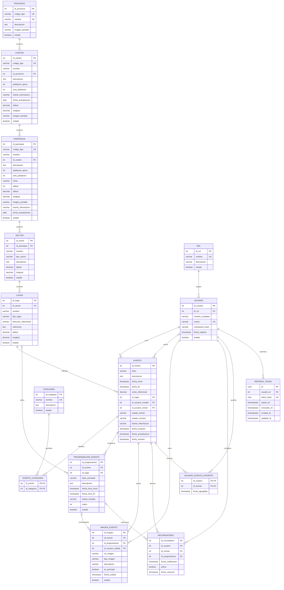

# Modelo de datos de ZamoraFest

## Estado vigente

Este documento describe el modelo de datos vigente de ZamoraFest después de la realineación `008-realineacion-modelo-semana4`.

El modelo funcional corresponde a las **14 entidades canónicas de Semana 4**. La tabla `refresh_token` se mantiene adicionalmente como una **extensión técnica de autenticación** y no forma parte del conteo académico de 14 entidades.

La implementación actual utiliza PostgreSQL y Prisma ORM. Las 12 entidades funcionales con clave primaria simple utilizan identificadores enteros autoincrementales. `evento_categoria` y `usuario_evento_favorito` utilizan claves primarias compuestas por identificadores enteros. Los nombres físicos de las tablas son singulares y se aplican claves foráneas explícitas, restricciones de integridad e índices. `refresh_token` conserva un UUID técnico propio.

## Entidades canónicas

1. `provincia`
2. `canton`
3. `parroquia`
4. `sector`
5. `lugar`
6. `rol`
7. `usuario`
8. `categoria`
9. `evento`
10. `evento_categoria`
11. `programacion_evento`
12. `imagen_evento`
13. `recordatorio`
14. `usuario_evento_favorito`

`refresh_token` se documenta separadamente como extensión técnica.

## Diagrama entidad-relación

## Responsabilidad de las entidades

| Entidad | Responsabilidad |
| --- | --- |
| `provincia` | Nivel territorial superior utilizado por ZamoraFest. |
| `canton` | Cantones pertenecientes a una provincia. |
| `parroquia` | Parroquias pertenecientes a un cantón. |
| `sector` | Barrio, comunidad, recinto, ciudadela, cabecera parroquial u otro sector de una parroquia. |
| `lugar` | Espacio físico donde se desarrolla un evento o una actividad programada. |
| `rol` | Catálogo persistente de roles de acceso. |
| `usuario` | Persona autenticable vinculada a un rol. |
| `categoria` | Clasificación temática de eventos. |
| `evento` | Entidad principal de la agenda cultural y festiva. |
| `evento_categoria` | Relación muchos-a-muchos entre eventos y categorías. |
| `programacion_evento` | Actividades, horarios y ubicaciones particulares de un evento. |
| `imagen_evento` | Imágenes de un evento o, opcionalmente, de una programación del mismo evento. |
| `recordatorio` | Preferencia de notificación configurada por un usuario para un evento o programación. |
| `usuario_evento_favorito` | Relación de favoritos entre usuarios y eventos. |

## Jerarquía territorial

La jerarquía implementada es:

`provincia -> canton -> parroquia -> sector -> lugar`

Cada cantón pertenece a una provincia, cada parroquia a un cantón, cada sector a una parroquia y cada lugar a un sector.

`sector.tipo_sector` admite:

- `BARRIO`
- `COMUNIDAD`
- `RECINTO`
- `CIUDADELA`
- `CABECERA_PARROQUIAL`
- `OTRO`

`CABECERA_PARROQUIAL` permite representar de forma controlada lugares para los que no existe un sector más específico sin romper la jerarquía relacional.

`lugar.tipo_lugar` admite:

- `PARQUE`
- `COLISEO`
- `BALNEARIO`
- `CANCHA`
- `RECINTO_FERIAL`
- `CASA_COMUNAL`
- `OTRO`

## Usuarios y roles

`rol` es una entidad persistente, no un enum técnico.

Los roles funcionales de la aplicación son:

- `ADMINISTRADOR`
- `ASISTENTE`
- `VISITANTE`

Cada `usuario` referencia obligatoriamente un `rol`. El correo es único y la contraseña se persiste únicamente como `contrasena_hash`. La activación funcional de usuarios y roles se controla mediante `estado`.

## Eventos

`evento` separa el ciclo funcional del flujo de revisión.

### Estado funcional

`estado_evento` admite únicamente:

- `BORRADOR`
- `PROGRAMADO`
- `CANCELADO`
- `FINALIZADO`
- `ELIMINADO`

### Estado de revisión

`estado_revision` admite únicamente:

- `PENDIENTE`
- `APROBADO`
- `RECHAZADO`

Un evento nuevo inicia con:

- `estado_evento = BORRADOR`
- `estado_revision = PENDIENTE`

Un evento es público únicamente cuando cumple simultáneamente:

- `estado_evento = PROGRAMADO`
- `estado_revision = APROBADO`

`ELIMINADO` representa eliminación lógica; el registro permanece físicamente almacenado.

`fecha_fin` es opcional. Si existe, debe ser mayor o igual que `fecha_inicio`.

`costo_referencial` es obligatorio y no puede ser negativo.

`id_usuario_creador` conserva la autoría del registro. `id_usuario_revisor` y `fecha_revision` permiten conservar la trazabilidad de la revisión. `fecha_actualizacion` registra modificaciones posteriores.

## Categorías

`evento_categoria` materializa la relación muchos-a-muchos entre eventos y categorías.

Su clave primaria compuesta es:

`(id_evento, id_categoria)`

Con esta restricción una categoría no puede asociarse dos veces al mismo evento.

## Programación de eventos

`programacion_evento` registra actividades particulares de un evento.

Cada programación:

- pertenece obligatoriamente a un evento;
- puede utilizar un lugar específico;
- posee `fecha_hora_inicio`;
- puede tener `fecha_hora_fin`;
- puede incluir artista invitado y orden;
- utiliza `estado` para su activación funcional.

Cuando `fecha_hora_fin` existe debe ser mayor o igual que `fecha_hora_inicio`.

La combinación `(id_evento, id_programacion)` es única y actúa como clave candidata para las relaciones compuestas de imágenes y recordatorios.

## Imágenes

`imagen_evento` pertenece obligatoriamente a un evento y al usuario que realizó la carga.

`id_programacion` es opcional. Cuando existe, la clave foránea compuesta `(id_evento, id_programacion)` garantiza que la programación pertenezca al mismo evento que la imagen.

`tipo_imagen` admite únicamente:

- `AFICHE`
- `FOTOGRAFIA`
- `OTRA`

Existe un índice único parcial que permite como máximo una imagen principal activa por evento cuando `es_principal = TRUE` y `estado = TRUE`.

## Favoritos

`usuario_evento_favorito` implementa la relación muchos-a-muchos entre usuarios y eventos.

Su clave primaria compuesta es:

`(id_usuario, id_evento)`

Por diseño, un usuario no puede registrar dos veces el mismo evento como favorito. `fecha_agregado` conserva la fecha de creación de la asociación.

## Recordatorios

`recordatorio` utiliza un identificador entero y pertenece obligatoriamente a un usuario y a un evento.

La programación es opcional. Cuando existe `id_programacion`, la relación compuesta `(id_evento, id_programacion)` garantiza que la programación pertenezca al mismo evento.

Los campos funcionales persistidos son:

- `id_recordatorio`
- `id_usuario`
- `id_evento`
- `id_programacion`
- `fecha_notificacion`
- `activo`
- `fecha_creacion`

Los estados técnicos de ejecución de BullMQ no forman parte de esta entidad funcional.

## Extensión técnica `refresh_token`

`refresh_token` **no es una de las 14 entidades canónicas de Semana 4**.

Se conserva como extensión técnica necesaria para implementar autenticación mediante token de acceso y renovación de sesión.

Sus campos son:

- `id`: UUID técnico;
- `usuario_id`: FK hacia `usuario`;
- `token_hash`: hash único del refresh token;
- `expira_en`;
- `revocado_en`;
- `created_at`;
- `updated_at`.

Los campos temporales de `refresh_token` utilizan `TIMESTAMPTZ(3)` porque representan instantes técnicos de autenticación.

Esta extensión no reemplaza, elimina ni altera ninguna entidad del modelo funcional de Semana 4.

## Política temporal

Los campos temporales del dominio utilizan `TIMESTAMP(3)` sin zona horaria. La aplicación interpreta las fechas del dominio según la política temporal definida para ZamoraFest, basada en `America/Guayaquil`.

Los timestamps técnicos de `refresh_token` utilizan `TIMESTAMPTZ(3)`.

## Restricciones de coordenadas

En `canton`, `parroquia`, `sector` y `lugar`:

- la latitud debe estar entre -90 y 90;
- la longitud debe estar entre -180 y 180;
- latitud y longitud deben estar ambas presentes o ambas ausentes.

## Restricciones e integridad referencial

Las reglas principales implementadas son:

- códigos DPA únicos en `provincia`, `canton` y `parroquia`;
- nombre único de `provincia`;
- nombre de `sector` único dentro de una parroquia;
- nombre de `lugar` único dentro de un sector;
- nombre de `rol` único;
- correo de usuario único;
- nombre de categoría único;
- costo de evento no negativo;
- fechas de evento ordenadas;
- fechas de programación ordenadas;
- una única imagen principal activa por evento;
- favorito único por usuario y evento;
- programación opcional de imagen perteneciente al mismo evento;
- programación opcional de recordatorio perteneciente al mismo evento.

Las relaciones territoriales, usuarios, eventos, programación, imágenes y recordatorios utilizan borrado físico restrictivo donde corresponde.

Las tablas puente `evento_categoria` y `usuario_evento_favorito` utilizan `ON DELETE CASCADE` sobre sus asociaciones.

## Índices relevantes

Entre los índices vigentes se encuentran:

- eventos por estado funcional, estado de revisión y fecha de inicio;
- eventos por fecha de inicio;
- usuarios por rol y estado;
- programaciones por evento, estado e inicio;
- imágenes por evento y estado;
- recordatorios por usuario, estado activo y fecha de notificación;
- relaciones inversas de categorías y favoritos;
- refresh tokens por usuario, revocación y expiración.

## Seed canónico

El seed actual prepara de forma idempotente:

- 1 provincia;
- 9 cantones;
- 1 parroquia de referencia;
- 1 sector;
- 1 lugar;
- 3 categorías;
- 3 roles;
- usuarios de entorno configurados mediante variables locales.

Las credenciales reales no se versionan ni se documentan.

## Verificación técnica vigente

Después de la realineación y de la Puerta G10 se verificó:

| Control | Resultado |
| --- | --- |
| `npm run typecheck` | Correcto |
| `npm run lint` | Correcto |
| `npm run test` | 216 pruebas aprobadas |
| `npm run test:integration` | 21 pruebas aprobadas |
| `npm run build` | Correcto |
| Migraciones pendientes | Ninguna |
| Entidades funcionales canónicas | 14 |
| Extensión técnica de autenticación | `refresh_token` |

La integración automatizada utiliza exclusivamente `zamorafest_test`.

## Trazabilidad histórica

La versión anterior de `docs/modelo-datos.md` correspondía a `001-modelo-datos` y describía un modelo reducido de siete entidades con identificadores UUID.

Ese contenido constituye evidencia histórica de una etapa previa, pero no representa el modelo vigente.

La realineación actual está documentada en:

`spec/features/008-realineacion-modelo-semana4/`

La actualización de las especificaciones históricas afectadas se realiza separadamente en T055 para conservar la trazabilidad sin reescribir la evidencia original.
