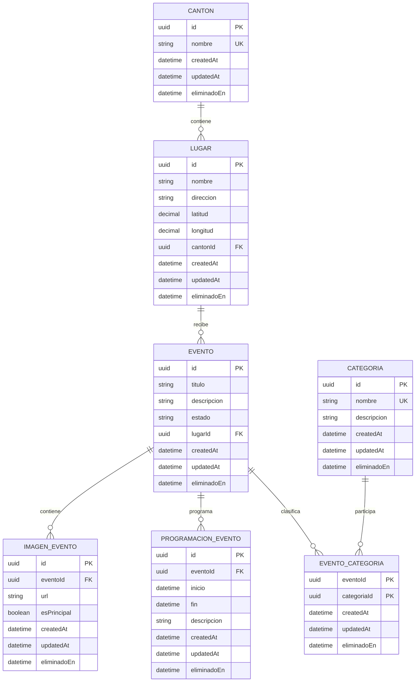

# Especificación: modelo de datos y backend inicial (001)

> [!IMPORTANT]
> **Vigencia:** este documento conserva la evidencia histórica de la funcionalidad `001-modelo-datos` aprobada el 2026-07-19. Su modelo reducido de siete entidades y las decisiones asociadas quedaron **supersedidos para el estado vigente del proyecto** por `spec/features/008-realineacion-modelo-semana4/`, que realinea ZamoraFest con el modelo canónico de Semana 4.
>
> El contenido histórico que sigue no se reescribe ni elimina; se conserva para mantener la trazabilidad técnica y académica.

## Metadatos

- **Rama:** `feat/001-modelo-datos`.
- **Estado:** aprobada.
- **Fecha de aprobación:** 2026-07-19.
- **Depende de:** constitución técnica ubicada en `spec/constitution/`.
- **Bloquea a:** `002-gestion-eventos`, `003-autenticacion-roles` y las etapas posteriores.

## Origen

Esta funcionalidad corresponde a la Etapa 2 de la hoja de ruta de ZamoraFest.

Se fundamenta en:

- Las orientaciones de las Semanas 4 y 5 sobre arquitectura cliente-servidor, modelo relacional, entidades, cardinalidades, reglas de negocio, normalización, restricciones, índices y uso de ORM.
- La definición de ZamoraFest presentada en los foros: eventos, lugares, cantones, categorías, fechas, imágenes, ubicaciones y recordatorios.
- La recomendación del docente de conservar trazabilidad mediante eliminación lógica.
- La constitución técnica aprobada mediante el pull request número 1.

## Objetivo

Construir la base técnica inicial de ZamoraFest y definir un modelo relacional en PostgreSQL, gestionado mediante Prisma, que permita almacenar eventos culturales y festivos de Zamora Chinchipe organizados por cantón, lugar y categoría, con programación e imágenes.

Al finalizar esta funcionalidad deberá existir un backend mínimo ejecutable, comprobable y preparado para implementar posteriormente el CRUD de eventos.

## Alcance

### Incluye

- Inicialización del backend mediante npm.
- Archivo `package-lock.json` versionado.
- Configuración estricta de TypeScript.
- Servidor Express ejecutable.
- Validación de variables de entorno.
- Configuración de ESLint y Prettier.
- Configuración inicial de Vitest y Supertest.
- Endpoint técnico `GET /api/v1/health`.
- Configuración de Prisma.
- Conexión con PostgreSQL.
- Definición de entidades, campos y relaciones.
- Diagrama entidad-relación.
- Reglas de negocio del modelo.
- Eliminación lógica.
- Migración inicial reproducible.
- Pruebas básicas del backend y del modelo.

### No incluye

- Endpoints de negocio para crear, consultar, actualizar o eliminar eventos.
- Registro o autenticación de usuarios.
- Roles y permisos.
- Refresh tokens.
- Favoritos.
- Recordatorios.
- Caché Redis.
- BullMQ.
- Estrategias `basic` y `detailed`.
- Aplicación Ionic o Capacitor.
- Swagger durante esta primera funcionalidad.

El endpoint de salud es una comprobación técnica y no constituye un endpoint de negocio.

## Resultado esperado del backend inicial

El backend deberá:

1. Instalarse mediante npm utilizando el archivo de bloqueo versionado.
2. Comprobar los tipos de TypeScript en modo estricto.
3. Ejecutarse utilizando variables de entorno validadas.
4. Responder `200 OK` en `GET /api/v1/health`.
5. Devolver una respuesta JSON mínima y estable que indique que el servicio está disponible.
6. Conectarse a PostgreSQL mediante Prisma.
7. Ejecutar pruebas automatizadas básicas.
8. Compilar sin errores.
9. No contener credenciales ni secretos reales.

Los scripts, dependencias exactas y estructura de carpetas se definirán en `plan.md`.

## Justificación del modelo relacional

ZamoraFest utilizará PostgreSQL porque sus datos presentan relaciones claras y requieren integridad referencial.

El modelo necesita:

- Relacionar eventos con lugares.
- Relacionar lugares con cantones.
- Relacionar eventos y categorías.
- Mantener varias programaciones por evento.
- Mantener varias imágenes por evento.
- Evitar asociaciones duplicadas.
- Aplicar restricciones y reglas de integridad.
- Consultar eventos mediante filtros de cantón, categoría y fecha.

Una base relacional permite expresar estas relaciones mediante claves primarias, claves foráneas, restricciones e índices. También facilita las migraciones y el acceso tipado mediante Prisma.

## Entidades

### Canton

Representa un cantón perteneciente al ámbito geográfico de ZamoraFest.

| Campo | Tipo conceptual | Regla |
|---|---|---|
| `id` | UUID | Clave primaria |
| `nombre` | String | Obligatorio y único |
| `createdAt` | DateTime | Automático |
| `updatedAt` | DateTime | Automático |
| `eliminadoEn` | DateTime opcional | `null` mientras el registro esté activo |

Un cantón puede contener varios lugares.

No se crearán entidades adicionales para provincia, parroquia o sector durante esta fase.

### Lugar

Representa el sitio donde se realiza un evento.

| Campo | Tipo conceptual | Regla |
|---|---|---|
| `id` | UUID | Clave primaria |
| `nombre` | String | Obligatorio |
| `direccion` | String opcional | Dirección descriptiva |
| `latitud` | Decimal opcional | Entre −90 y 90 |
| `longitud` | Decimal opcional | Entre −180 y 180 |
| `cantonId` | UUID | Obligatorio, referencia a `Canton` |
| `createdAt` | DateTime | Automático |
| `updatedAt` | DateTime | Automático |
| `eliminadoEn` | DateTime opcional | `null` mientras el registro esté activo |

Un lugar pertenece a exactamente un cantón. Un cantón puede tener varios lugares.

Latitud y longitud deberán proporcionarse juntas o permanecer ambas vacías.

### Categoria

Clasifica los eventos culturales y festivos.

| Campo | Tipo conceptual | Regla |
|---|---|---|
| `id` | UUID | Clave primaria |
| `nombre` | String | Obligatorio y único |
| `descripcion` | String opcional | Información complementaria |
| `createdAt` | DateTime | Automático |
| `updatedAt` | DateTime | Automático |
| `eliminadoEn` | DateTime opcional | `null` mientras el registro esté activo |

Una categoría puede asociarse con varios eventos.

### Evento

Representa la información principal de un evento.

| Campo | Tipo conceptual | Regla |
|---|---|---|
| `id` | UUID | Clave primaria |
| `titulo` | String | Obligatorio |
| `descripcion` | String | Obligatorio |
| `estado` | `EstadoEvento` | Obligatorio, valor inicial `BORRADOR` |
| `lugarId` | UUID | Obligatorio, referencia a `Lugar` |
| `createdAt` | DateTime | Automático |
| `updatedAt` | DateTime | Automático |
| `eliminadoEn` | DateTime opcional | `null` mientras el registro esté activo |

El enum `EstadoEvento` tendrá únicamente:

- `BORRADOR`.
- `PUBLICADO`.

Un evento pertenece a exactamente un lugar. Un lugar puede contener varios eventos.

No se introducirán estados adicionales sin una necesidad académica o técnica documentada.

### EventoCategoria

Representa explícitamente la relación muchos-a-muchos entre eventos y categorías.

| Campo | Tipo conceptual | Regla |
|---|---|---|
| `eventoId` | UUID | Referencia a `Evento` |
| `categoriaId` | UUID | Referencia a `Categoria` |
| `createdAt` | DateTime | Automático |
| `updatedAt` | DateTime | Automático |
| `eliminadoEn` | DateTime opcional | `null` mientras la asociación esté activa |

La clave primaria será compuesta por `eventoId` y `categoriaId`.

Esto impedirá crear dos asociaciones simultáneas para el mismo evento y la misma categoría.

Si una asociación eliminada lógicamente vuelve a utilizarse, deberá reactivarse en lugar de insertar un duplicado.

La sintaxis concreta de Prisma se definirá en `plan.md`.

### ProgramacionEvento

Representa una actividad, fecha u horario perteneciente a un evento.

| Campo | Tipo conceptual | Regla |
|---|---|---|
| `id` | UUID | Clave primaria |
| `eventoId` | UUID | Obligatorio, referencia a `Evento` |
| `inicio` | DateTime | Obligatorio |
| `fin` | DateTime opcional | Debe ser posterior a `inicio` |
| `descripcion` | String opcional | Por ejemplo, “Concierto de apertura” |
| `createdAt` | DateTime | Automático |
| `updatedAt` | DateTime | Automático |
| `eliminadoEn` | DateTime opcional | `null` mientras el registro esté activo |

Un evento puede tener varias entradas de programación.

La selección del tipo físico de PostgreSQL y el tratamiento de zona horaria se resolverán en `plan.md`.

### ImagenEvento

Representa una imagen asociada con un evento.

| Campo | Tipo conceptual | Regla |
|---|---|---|
| `id` | UUID | Clave primaria |
| `eventoId` | UUID | Obligatorio, referencia a `Evento` |
| `url` | String | Obligatoria y con formato válido |
| `esPrincipal` | Boolean | Obligatorio, valor inicial `false` |
| `createdAt` | DateTime | Automático |
| `updatedAt` | DateTime | Automático |
| `eliminadoEn` | DateTime opcional | `null` mientras el registro esté activo |

Un evento puede tener varias imágenes.

Como máximo una imagen no eliminada de un evento podrá tener `esPrincipal = true`.

El mecanismo técnico para garantizar esta regla se definirá en `plan.md`.

## Diagrama entidad-relación preliminar

## Reglas de negocio

1. Todo evento deberá crearse inicialmente en estado `BORRADOR`.
2. Solo un evento `PUBLICADO` y no eliminado podrá aparecer posteriormente en consultas públicas.
3. Todo evento deberá estar asociado con un lugar activo y todo lugar con un cantón activo.
4. La misma categoría no podrá asociarse dos veces al mismo evento.
5. Una asociación eliminada en `EventoCategoria` deberá reactivarse si vuelve a utilizarse.
6. Un evento podrá tener como máximo una imagen principal que no esté eliminada.
7. Cuando una programación tenga fecha de finalización, `fin` deberá ser posterior a `inicio`.
8. Latitud y longitud deberán proporcionarse juntas y respetar sus rangos geográficos.
9. La eliminación funcional se realizará estableciendo `eliminadoEn`; la aplicación no borrará físicamente los registros.
10. Las consultas normales deberán excluir registros con `eliminadoEn` diferente de `null`.
11. Un cantón con lugares activos o un lugar con eventos activos no podrá eliminarse lógicamente sin una validación explícita.
12. Los nombres únicos eliminados no se duplicarán; cuando corresponda, el registro existente deberá reactivarse.
13. La transición de un evento a `PUBLICADO` deberá validarse posteriormente en la gestión de eventos.
14. No se añadirán estados, entidades o relaciones que no respondan al alcance aprobado.

## Política de eliminación lógica

La eliminación lógica se aplicará mediante el campo nullable `eliminadoEn`.

Esta decisión busca:

- Conservar trazabilidad.
- Evitar pérdida accidental de información.
- Mantener relaciones históricas.
- Permitir una futura reactivación sin crear duplicados.
- Cumplir la recomendación académica de evitar eliminaciones físicas.

Durante esta funcionalidad no se crearán endpoints de eliminación ni restauración. La implementación del método HTTP `DELETE` corresponderá a `002-gestion-eventos`.

No se añadirá todavía `eliminadoPorId`, porque dependerá de la entidad de usuarios que se incorporará en `003-autenticacion-roles`.

## Consultas futuras que el modelo deberá soportar

El diseño deberá permitir posteriormente:

- Listar eventos publicados y no eliminados.
- Paginar eventos.
- Filtrar eventos por cantón.
- Filtrar eventos por categoría.
- Filtrar eventos por fecha de programación.
- Consultar un evento con su lugar y cantón.
- Consultar categorías activas de un evento.
- Consultar su programación activa.
- Obtener su imagen principal activa.
- Recuperar información ampliada sin provocar consultas N+1.

Estos comportamientos no se implementarán en 001, pero orientarán las relaciones y los índices.

## Normalización esperada

El modelo deberá revisarse hasta tercera forma normal:

- Los campos deberán contener valores atómicos.
- Los datos de cantón no se repetirán dentro de lugares o eventos.
- Los datos de lugar no se repetirán dentro de eventos.
- Las categorías se almacenarán independientemente.
- La relación muchos-a-muchos se resolverá mediante `EventoCategoria`.
- Programaciones e imágenes se almacenarán separadas de `Evento`.
- Los atributos deberán depender de su clave correspondiente.

La justificación detallada se desarrollará en `plan.md`.

## Criterios de aceptación

1. El backend se instala utilizando npm y genera un resultado reproducible mediante `package-lock.json`.
2. TypeScript funciona en modo estricto y completa la comprobación de tipos.
3. ESLint y Prettier quedan configurados.
4. El servidor Express puede iniciarse mediante un script documentado.
5. Las variables de entorno requeridas se validan al arrancar.
6. `GET /api/v1/health` responde `200 OK` con JSON.
7. Existe al menos una prueba automatizada del endpoint de salud.
8. Prisma valida correctamente su esquema.
9. Prisma Client puede generarse.
10. Se genera una migración inicial versionada.
11. La migración puede reconstruir la base de datos desde cero.
12. Existen exactamente las siete entidades de dominio descritas.
13. Las claves foráneas rechazan referencias inexistentes.
14. La clave compuesta de `EventoCategoria` evita asociaciones duplicadas.
15. Todas las entidades incluyen el campo `eliminadoEn`.
16. Las reglas de fechas, coordenadas e imagen principal cuentan con un mecanismo verificable definido en `plan.md`.
17. Ninguna prueba deja dos imágenes principales activas para un mismo evento.
18. Los archivos `.env` reales no se incorporan al repositorio.
19. Se proporciona un `.env.example` sin secretos.
20. `package-lock.json` y las migraciones de Prisma quedan versionados.
21. Los comandos de compilación, tipos, lint y pruebas se ejecutan sin errores.
22. No se implementan funcionalidades fuera del alcance de 001.

## Fuera de alcance

- CRUD HTTP de eventos.
- Publicación y administración de eventos.
- Usuarios, roles y autenticación.
- Refresh tokens.
- Favoritos.
- Recordatorios.
- Redis.
- BullMQ.
- Prevención de N+1.
- Estrategias `basic` y `detailed`.
- Compresión de respuestas.
- Aplicación móvil.
- Provincia, parroquia y sector como entidades.
- Proveedores externos de mapas.
- Carga real de imágenes.
- Swagger en esta funcionalidad.

Cuando Swagger sea incorporado, su interfaz y el documento OpenAPI no deberán quedar expuestos públicamente en un despliegue real.

## Preguntas obligatorias para `plan.md`

1. ¿Cuál será la estructura mínima de carpetas del backend?
2. ¿Qué versiones compatibles se instalarán?
3. ¿Qué scripts npm se configurarán?
4. ¿Qué variables se incluirán en `.env.example`?
5. ¿Cómo se configurará TypeScript estricto?
6. ¿Cómo se separarán la creación de la aplicación Express y el arranque del servidor?
7. ¿Qué verificará exactamente el endpoint de salud?
8. ¿Dónde se ubicará `schema.prisma`?
9. ¿Qué nombres físicos usarán tablas y columnas en PostgreSQL?
10. ¿Qué tipos nativos se utilizarán para UUID, decimales y fechas?
11. ¿Cómo se manejará la zona horaria?
12. ¿Cómo se garantizará una sola imagen principal activa por evento?
13. ¿Qué restricciones `CHECK` serán necesarias?
14. ¿Cómo se aplicará la eliminación lógica en las consultas?
15. ¿Qué relaciones utilizarán `Restrict` y cuáles no deberán eliminar físicamente?
16. ¿Qué índices responderán a filtros por estado, cantón, categoría y fecha?
17. ¿Cómo se justificará la primera, segunda y tercera forma normal?
18. ¿Se cargarán los cantones mediante datos iniciales y cómo se hará de manera reproducible?
19. ¿Cómo se aislará la base de datos utilizada por las pruebas?
20. ¿Qué comandos verificarán la aceptación antes del commit?

Estas preguntas deberán resolverse y documentarse antes de modificar `schema.prisma` o instalar dependencias.